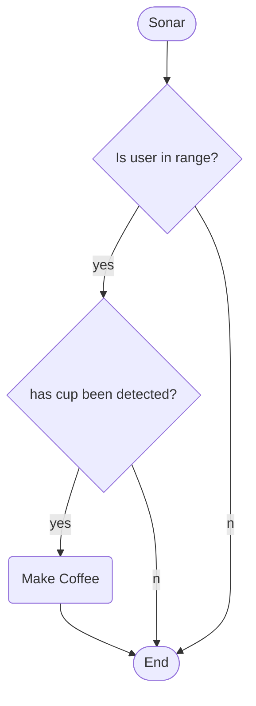

## User and cup detection

```mermaid
flowchart TD
    Start([Sonar])
    checkUser{Is user in range?}
    checkCup{has cup been detected?}
    makeCoffee(Make Coffee)
    End([End])
    
    Start-->checkUser--yes-->
    checkCup--yes-->makeCoffee-->End
    checkUser--no-->End
    checkCup--no-->End
```